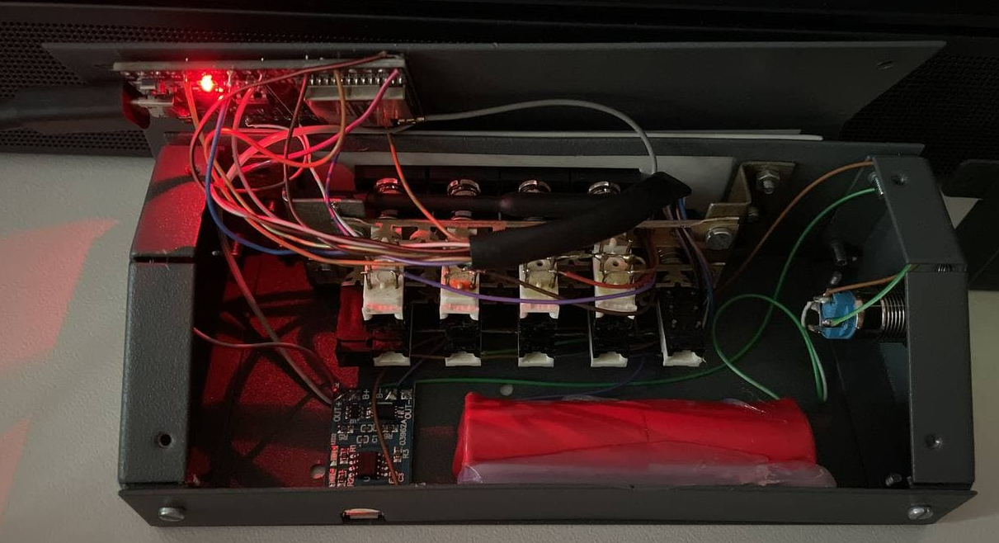

## Project setup

Install and update [PlatformIO Core](https://docs.platformio.org/en/latest/core/installation.html).

Initialize the project:
```console
$ pio project init
```

## Build

```console
$ pio run
```

## Upload to the deck

Remove the bottom panel's screws and *gently* lift the panel,
because the ESP32 board is taped to the panel itself,
on the same time it's wired to controls and power!



Connect the board to PC using micro-USB cable and use `pio` to build & upload firware:

```console
$ pio run --target upload
```
